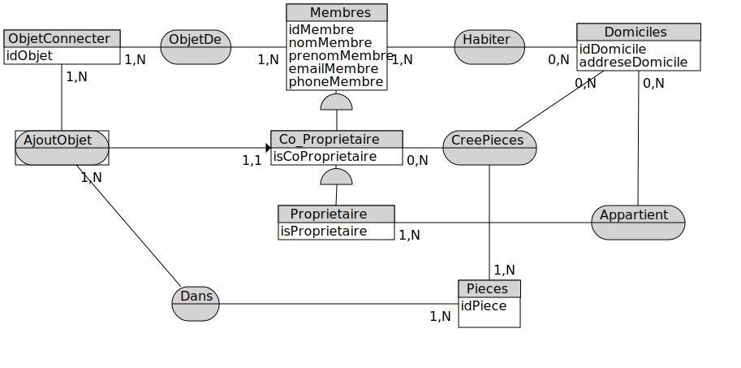

# 
Programme D-CLIC
# 
 Module : UML/Merise
# 
 JARVIS partie 1

# Analyse de la diagramme cas utilistion

## Acteur 
* Primaire :
	* Proprietaire
	* Co-propriétaire
	* Membre
* Secondaire :
	* GOOGLE API

# MCD 

