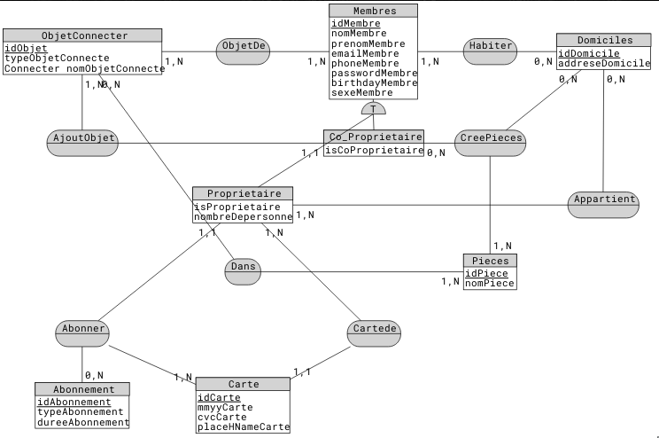

# 
Programme D-CLIC
# 
 Module : UML/Merise
# 
 JARVIS partie 1

# 1 Analyse de la diagramme des cas utilisation

## 1.1 Liste des Acteurs 
* **Primaire** :
	* Proprietaire
	* Co-propriétaire
	* Membre
	* Visiteur

* **Secondaire** :
	* GOOGLE API

## 1.2 Fonctionnalité pour chaque acteur:

* **Visiteur** :
	* S'authentifier

* **Membre** : 
	* S'authentifier
	* Récupérer la liste des pieces
	* Récupération de la liste des objets connecter _(**Obligatoire**)_
	* Modification d'un Objet connecter _(Optionnelle)_
	* Mettre en place un objet connecter dans une pièce _(Optionnelle)_

* **Co-Propriétaire** :
	* S'authentifier
	* Récupérer la liste des pieces
	* Récupération de la liste des objets connecter
	* Modification d'un Objet connecter
	* Mettre en place un objet connecter dans une pièce _(**Obligatoire**)_
	* Ajouter un objet connecter
	* Créé une nouvelle pièce

* **Propriétaire** :
	* S'authentifier
	* Récupérer la liste des pieces
	* Récupération de la liste des objets connecter
	* Modification d'un Objet connecter
	* Mettre en place un objet connecter dans une pièce
	* Modifier le role d'un utilisateur
	* Cree un Domicile
	* Rechercher d'adrese _(**Obligatoire**)_

* **GOOGLE API** : 
	* Fournir l'adresse démander

## 1.3 Les actions obigatoire/optionnelle
Elle sont Marqué dans la section 1.2

# 2 MCD 

## 2.1 Liste des Entintés et leurs propriété respéctives

* Membre
* Co-proprietaire
* ProPrietaire
* ObjetConnecter
* Abonnement
* Carte
* Piece
* Domicile

## 2.2 Les associations entre divers Entités

* **Membre** :
	* _Habiter_ dans un **Domicile**
	* _Avoir_ un **ObjetConnecter**
* **Co-Proprietaire** :
	* _Cree_ **Piece** dans un *Domicile*
	* _AjouterObjetConncter_ dans une **Piece**

* **Proprietaire**:
	* _Propritaire_ (Appartien) d'un **Domicile**
	* _Abonner_ a un **Abonnement**
	* _Avoir_(carte de) **Carte**
